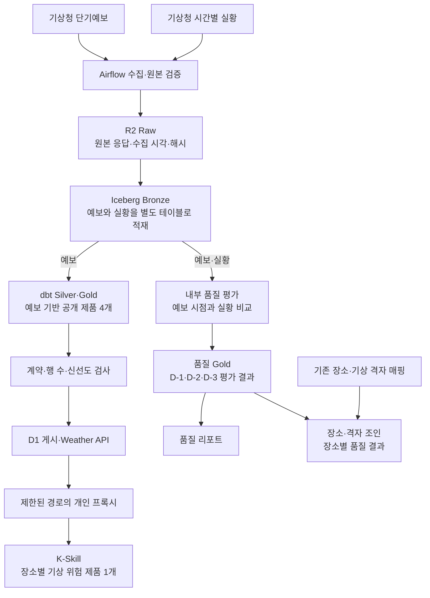

# Seoul Weather Platform

기상청 예보와 시간별 실황을 수집해 R2·Iceberg에 적재하고, dbt로 가공한 데이터를 D1과 K-Skill에 제공하는 기상 데이터 플랫폼이다. 예보를 제공하는 처리 경로와 예보의 정확도를 평가하는 처리 경로를 분리해 관리한다.

ASK Seoul 팀 프로젝트의 Weather 코드를 고정된 커밋에서 이관한 뒤, 개인 저장소에서 수집 비용 관리, 장애 복구 계획, 예보 품질 평가와 장소별 품질 조회를 추가했다. 팀 코드의 출처와 개인 후속 변경은 [원본 커밋 목록](provenance/source-refs.lock.json), [파일별 변경 이력](provenance/source-files.jsonl), [NOTICE](NOTICE)에 남긴다.

**주요 기술**: Python, SQL, Airflow, dbt, Trino, Apache Iceberg, Cloudflare R2·D1·Workers, GitHub Actions.

## 데이터 처리 흐름



위 그림은 논리적인 데이터 흐름이다. 수집 직후 Bronze로 넘기는 원본은 검증된 로컬 임시 파일을 재사용해 같은 R2 객체를 불필요하게 다시 읽지 않도록 했다.

공개 예보 제품은 예보 데이터를 사용하고, 내부 품질 평가는 저장된 예보와 실황을 함께 읽는다. 품질 평가 결과를 D1이나 K-Skill에 게시하는 경로는 없으며, 품질 평가 실패가 공개 제품의 데이터 의존성으로 이어지지 않도록 분리했다. 다만 같은 로컬 Trino 자원을 사용하므로 실행 시간과 동시 실행 수는 별도로 제한한다.

## 주요 구현

### 1. 원본 보존과 재실행 가능한 수집

- 원본 응답과 함께 수집 시각, 요청 결과, 원본 객체 경로와 해시를 보존한다.
- 실황 수집은 80개 기상 격자의 필수 항목과 기준 시각을 검사한다. 일부 격자나 항목이 빠진 응답을 정상 데이터로 취급하지 않는다.
- 예보와 실황 요청은 공유 호출 횟수 기록을 사용한다. 재시도도 실제 요청 횟수에 포함하며, 일시적인 통신 오류와 인증·스키마 오류를 구분한다.
- 원본에서 표준화·중복 제거를 거쳐 제품을 만드는 Bronze → Silver → Gold 구조를 유지한다. 작업 재시도와 데이터 중복 방지는 별개의 문제로 다룬다.

관련 코드: [실황 수집 DAG](dags/domains/weather/weather_ultra_srt_ncst_bronze.py), [실황 데이터 계약](docs/architecture/kma-observation-truth.md), [수집·Bronze 적재 코드](dags/domains/weather/weather_ingest).

### 2. 외부 읽기와 메모리 사용 제한

- 원본을 수집한 뒤 해시가 검증된 로컬 임시 파일로 다음 작업에 전달한다. 임시 파일이 없거나 손상됐을 때는 원격 원본을 읽는 경로를 유지한다.
- Bronze 적재와 변환은 처리 범위와 메모리 사용을 제한한다. 전체 이력을 매번 다시 읽는 방식과 구분해 관리한다.
- Trino 메모리 상한, 실행 중인 쿼리 수, 대기열과 Airflow 실행 제한을 함께 사용한다. 자원 설정과 쿼리의 읽기 범위를 함께 확인한다.
- 비용 확인은 운영체제의 전체 네트워크 사용량만으로 판단하지 않고, 쿼리 읽기량·R2 요청·캐시 재사용·대기 시간을 구분하도록 기준을 정리했다.

관련 코드와 기록: [원본 재사용](dags/domains/weather/weather_ingest/raw_spool.py), [중복 원격 읽기 회귀 테스트](dags/domains/weather/tests/test_weather_raw_transfer_budget.py), [읽기 비용 측정 기준](docs/operations/weather-trino-read-measurement.md), [로컬 자원 설정](docker-compose.local.yml), [Trino 동시 실행 제한](trino/resource-groups.json).

여기에 적힌 설정값은 현재 저장소의 구성이다. 비용 절감률이나 처리 속도 개선률을 의미하지 않으며, 그런 수치는 같은 데이터·환경·측정 구간으로 비교한 기록이 있어야 한다.

### 3. 수집 장애의 복구 계획

수집 결과와 원본 보존 여부를 확인해 다음 행동을 결정한다.

- `RAW_REPLAY`: 검증된 원본을 이용한 재처리 후보
- `RECOLLECT`: 허용된 기간과 호출 예산 안에서 재수집할 후보
- `DEFERRED`: 실행 중인 작업이나 자원 제한 때문에 보류
- `BLOCKED`: 필요한 근거나 안전 조건이 부족해 차단

기본 정책은 한 번에 최대 3개 작업, 그중 API 재수집 최대 1개, 복구 대상 기간 24시간이다. 이 값들은 [복구 판단 로직](dags/common/recovery/planner.py)에 정의돼 있다.

[Coordinator DAG](dags/domains/weather/weather_recovery_coordinator.py)는 수집 기록을 읽어 계획을 생성하는 단계까지 연결돼 있다. DAG를 실행해도 복구 대상 DAG를 직접 호출하거나 R2·Trino·D1에 복구 데이터를 쓰지 않는다. 판단 로직의 구현과 실제 복구 실행을 같은 완료 상태로 표현하지 않는다.

### 4. 예보 시점을 보존하는 품질 평가

예보가 나중에 갱신됐다는 이유로 과거 평가 결과를 새 예보로 바꾸지 않도록, 예보 발표 시점과 평가 기준 시각을 분리한다.

- D-1·D-2·D-3 예보를 해당 시각의 실황과 연결한다.
- 평가마다 `evaluation_run_id`와 `evaluation_as_of`를 고정하고 결과 이력을 남긴다.
- 결측 예보, 결측 실황, 잘못된 입력과 계약 불일치를 구분한다. 값이 없다는 이유로 강수 없음이나 오차 0으로 채우지 않는다.
- 기온 오차, 강수 확률의 Brier score, 강수 형태 정확도와 표본 커버리지를 계산한다.
- 실황이 잠정값이면 평가 결과도 그 상태를 유지한다. 표본이 부족한 결과를 충분한 근거가 있는 결과처럼 표시하지 않는다.
- 품질 후보 결과는 검증을 마친 뒤 `SUCCESS` 매니페스트로 게시한다. 실패하거나 중단된 후보는 최신 결과 조회에서 제외한다.

관련 문서와 코드: [예보 품질 설계](docs/architecture/weather-forecast-quality.md), [품질 Gold 구조](docs/architecture/forecast-quality-gold.md), [리포트 생성](tools/forecast_quality_report.py), [품질 모델](dbt/domains/traffic_weather/models/weather/quality), [운영 절차](docs/operations/weather-forecast-quality-runbook.md).

### 5. 장소별 품질 결과와 공개 제품 보호

격자별 품질 결과를 기존 장소 매핑과 연결해 장소별로 확인할 수 있도록 했다. 지표가 없는 장소는 `NO_METRICS`로 남겨 커버리지 공백이 사라지지 않게 한다. 장소와 연결되지 않은 품질 결과를 임의의 장소에 배정하지 않는다.

공개 제품 게시에서는 데이터 계약, 행 수와 신선도를 확인하고 기존 정상 결과를 보존하는 경계를 유지한다. 적재 작업이 성공했다는 사실만으로 사용자에게 제공할 데이터가 정상이라고 판단하지 않는다.

관련 코드와 검증: [장소·격자 조인](tools/spatial_quality_product.py), [공간 제품 설계](docs/architecture/forecast-quality-spatial-product.md), [조인 테스트](tests/forecast_quality/test_spatial_product.py), [게시 계약](dags/common/serving).

## 운영 중 확인한 문제와 설계 변경

[2026-08-23 장애 기록](docs/data-engineering-decision.md)에 남긴 사례다. 현재 서비스 상태를 뜻하는 기록은 아니다.

- **유지보수 작업의 장시간 자원 점유**: Iceberg 유지보수가 약 10시간 동안 단일 Trino 작업 슬롯을 점유했다. 정기 유지보수보다 수집·게시를 우선하도록 기본 예약 실행을 없애고 작업 시간과 우선순위를 제한했다.
- **긴 작업 종료 뒤 인증 오류**: dbt 작업이 끝난 뒤 Airflow 내부 API에 결과를 보고하면서 JWT 만료로 403이 발생했다. 사용자 로그인 토큰과 작업 실행 API 토큰을 구분해 해당 설정을 수정했다.
- **R2 일시적 연결 실패**: 원본과 체크포인트 쓰기가 DNS 오류로 중단됐다. 중복·덮어쓰기 방지 조건 안에서만 통신 오류 재시도를 허용하고, 인증·계약 오류는 재시도하지 않도록 분리했다.
- **오래된 결과의 게시 차단**: 신선도 검사와 D1 게시 실패를 독립적인 원인으로 보지 않고, 앞단의 처리 지연을 차단한 결과로 구분했다. 게시를 통과시키기 위해 검사를 완화하지 않았다.

판단 과정과 기각한 대안은 [설계 판단 기록](docs/data-engineering-decision.md), 장애 흐름과 복기 내용은 [장애 기록](docs/lessonrun.md)에 정리했다.

## 공개 제품과 평가 대상

공개 Weather 제품은 다음 4개다. 내부 예보 품질 Gold는 이 목록에 포함하지 않는다.

| 용도 | 제품 식별자 | 현재 K-Skill 제공 |
|---|---|---|
| 장소별 현재 예보 | `weather_place_current_outlook` | 아니오 |
| 장소별 강수 예상 시간대 | `weather_place_precipitation_window` | 아니오 |
| 장소별 기상 위험 시간대 | `weather_place_risk_window` | 예 |
| 일 단위 예보 변화 | `weather_place_forecast_change_daily` | 아니오 |

- **80개 격자**는 예보 품질 평가에 사용하는 기상 격자 집합이다.
- **427개 장소**는 기존 제공 방식과 K-Skill 입력의 호환성을 유지하기 위한 장소 목록이다. 공식 행정동 수와 동일한 의미가 아니다.
- 현재 `seoul-weather-risk` K-Skill은 `weather_place_risk_window` 하나만 제공한다. K-Skill 실행 코드의 기준 저장소는 [NomaDamas/k-skill](https://github.com/NomaDamas/k-skill)이다.

개인 프록시는 허용된 세 경로만 개인 Weather API에 연결한다. K-Skill의 기본 프록시 대신 개인 프록시를 사용할 때는 `KSKILL_PROXY_BASE_URL`을 설정하며, 서비스 토큰은 Worker의 비밀값으로만 보관한다.

## 저장소 구성

```text
dags/                      기상 수집·변환·게시 DAG와 공통 처리
dbt/domains/traffic_weather/  Weather 모델·테스트·장소 및 격자 기준
weather_quality/           예보·실황 연결과 품질 평가 로직
contracts/                 데이터 계약·검증용 입력·결과
release/weather/           K-Skill 장소 산출물 생성과 검증
k-skill-proxy/             개인 Weather API 연결 프록시
tools/                     검증·리포트·복구 계획 도구
tests/                     저장소·제품·운영 계약 회귀 테스트
provenance/                고정 원본·파일별 출처·체크섬
docs/                      설계·운영 절차·장애 기록
```

이 저장소는 Weather 코드와 계약을 관리한다. 다른 ASK Seoul 도메인, 범용 Marketplace·OAuth 기능, K-Skill의 전체 실행 코드는 관리하지 않는다. 실제 R2·Iceberg·D1 데이터, 자격증명, Airflow 메타데이터와 실행 로그도 공개 저장소에 넣지 않는다.

## 검증 방법

### 운영 자원에 접근하지 않는 기본 검증

저장소 루트에서 Python 3.11 환경을 활성화한 뒤 실행한다. 세부 버전은 [도구 버전 목록](runtime/toolchain.lock.json)에 고정돼 있다.

```bash
python -m pip install pytest==9.0.3 jsonschema==4.26.0 PyYAML==6.0.2

python -m tools.repository_policy --repo-root .
python -m tools.verify_provenance --repo-root .
python -m tools.refresh_provenance --repo-root . --check
python -m tools.workflow_policy --repo-root .

python -m pytest tests/repository tests/deploy \
  tests/forecast_quality tests/contracts release/weather/tests -q
```

이 검사는 운영 자격증명을 사용하지 않고 Airflow 서비스나 DAG를 가동하지 않는다. 저장소 정책·출처·체크섬·제품 계약·품질 평가·장소 산출물의 재현성을 확인한다. PowerShell 환경에서는 [기본 검증 스크립트](tools/verify_repository.ps1)도 사용할 수 있다.

```powershell
pwsh -NoProfile -File tools/verify_repository.ps1 -PythonExecutable python
```

위 스크립트는 정책·체크섬 검증과 `tests/repository`, `tests/deploy`를 실행한다. 품질·제품·장소 검증은 앞의 pytest 명령에 별도로 포함돼 있다.

### CI에서 추가로 확인하는 항목

[GitHub Actions 설정](.github/workflows/ci.yml)은 다음 검사를 통과해야 병합할 수 있도록 구성했다.

- 고정된 dbt 의존성으로 모델 구문을 해석하고 공개 제품 계약을 검증한다.
- Airflow 관련 코드의 문법·DAG 경계·회귀 테스트를 실행한다.
- 운영 자원 없이 DAG의 불러오기 정책과 저장소 범위를 검사한다.
- 프록시 테스트와 main 반영 PR의 출처를 확인한다.

dbt를 직접 검증할 때는 [dbt 의존성 목록](runtime/requirements-dbt.lock.txt)을 사용하는 격리 환경을 준비한다. DAG를 고정된 Airflow 이미지 안에서 불러오는 검사는 [별도 검사 도구](tools/verify_dagbag.ps1)로 구분하며, 서비스 재시작이나 DAG 실행 검증과 혼동하지 않는다.

검증용 80개 격자 데이터는 합성 데이터다. 테스트 통과는 실제 서울 예보 정확도, 현재 서비스 가동 여부나 데이터 신선도를 증명하지 않는다. 실제 운영 검증에는 기준 시각, DAG 실행 결과, 데이터 행 수·커버리지·신선도와 확인 범위가 별도로 필요하다.

## 로컬 운영과 배포 기준

공통 `docker-compose.yml`에 `docker-compose.local.yml`을 조합하는 구성이다. 명령과 자원 설정은 [로컬 실행 문서](README-LOCAL.md), 리소스 소유 관계는 [현재 운영 의존성](docs/operations/current-resource-dependencies.md)을 따른다.

설정 예제와 로컬 설정은 다음처럼 다르다.

- `.env.example`: 공유 호출 제한 설정은 `false`, 관측 수집 스케줄은 비어 있다.
- [`docker-compose.local.yml`](docker-compose.local.yml): 공유 호출 제한을 켜고 관측 수집을 매시 45분(`45 * * * *`)으로 설정한다.
- 예보 품질 DAG의 스케줄은 로컬 설정에서도 비어 있다. 별도 품질 검증과 활성화 승인이 필요하다.
- 현재 [품질 DAG](dags/domains/weather/weather_quality_dag_factory.py)의 제한은 작업당 15분, DAG 실행당 45분이다. 품질 작업은 Weather 작업 풀의 2개 슬롯을 모두 요청한다.
- DAG의 최초 생성 시 정지 설정은 기존 DAG의 활성 상태를 바꾸지 않는다. 코드와 스케줄만 보고 현재 수집이 멈춰 있다고 판단하지 않는다.

이미지 빌드·서비스 재시작·DAG 활성화·수동 실행·과거 데이터 재처리는 운영 환경을 바꾸는 작업이다. 실행 전에 아래를 확인하고 운영 승인을 받는다.

1. 반영할 커밋과 영향을 받는 서비스·DAG
2. 실행·대기 중인 작업과 일시 중지·종료 대기 계획
3. 배포, 정상 동작 확인과 이전 상태 복구 순서
4. R2·Iceberg·Trino·D1의 읽기·쓰기 대상과 예상 영향

저장소 검증이나 PR 병합만으로 운영 변경이 승인되지는 않는다. 자세한 절차는 [Airflow 배포 전 확인 사항](docs/operations/predeployment-approval-gate.md)과 [품질 평가 운영 절차](docs/operations/weather-forecast-quality-runbook.md)를 따른다.

## 설계와 구현 근거

- [원본 커밋 목록](provenance/source-refs.lock.json) · [이관 파일 목록](provenance/source-inventory.json) · [파일별 출처와 체크섬](provenance/source-files.jsonl)
- [용어와 제품 범위](CONTEXT.md) · [저장소 분리 설계](docs/superpowers/specs/2026-08-14-weather-repository-separation-design.md) · [코드·운영 환경의 관리 범위](docs/architecture/platform-boundaries.md)
- [예보 품질 평가 설계](docs/architecture/weather-forecast-quality.md) · [품질 Gold 구조](docs/architecture/forecast-quality-gold.md) · [장소별 품질 제품](docs/architecture/forecast-quality-spatial-product.md)
- [초기 품질 리포트·재처리 설계](docs/runbooks/WEATHER_FORECAST_QUALITY_RUNBOOK.md) · [현재 품질 평가 운영 절차](docs/operations/weather-forecast-quality-runbook.md) · [관측 수집 활성화 전 확인 사항](docs/operations/kma-observation-predeployment-plan.md)
- [설계 판단과 근거](docs/data-engineering-decision.md) · [장애 기록](docs/lessonrun.md)

원본 코드는 현재 작업 폴더를 복사하지 않고, 출처 목록에 고정된 커밋에서 가져온다. 원본을 바꾸거나 파일을 수정하면 이관 목록·체크섬·검증 결과를 함께 갱신한다. 예전 설계 문서의 당시 설정과 현재 코드가 다를 수 있으므로 현재 구성은 설정 파일과 계약 테스트를 우선해 확인한다.

## 변경 반영 절차

기능·문서 변경은 `feat/` 브랜치에서 `dev` 대상 PR로 반영하고, 검증된 `dev`를 별도 PR로 `main`에 반영한다. 필수 CI와 검토를 거친 뒤 병합하며 보호 규칙을 우회하지 않는다.

`dev`는 선형 이력을 유지하므로 동기화 여부는 커밋 번호만으로 판단하지 않는다. 두 브랜치의 파일 내용은 `git diff origin/main origin/dev`로 확인한다.
