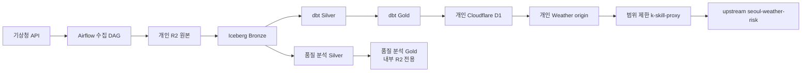

# 서울 날씨 데이터 플랫폼

기상청(KMA) 단기예보와 초단기 실황을 서울 80개 격자 기준으로 모으고, 원본을 보존한
뒤 `Trino`·`Iceberg`·`dbt`로 가공해 개인 Cloudflare R2/D1에서 제공하는 데이터 플랫폼이다.
예보 발표본을 시점별로 남기기 때문에 “3일 전에 본 예보가 실제 날씨와 얼마나 달랐는가?”를
나중에 같은 조건으로 다시 계산할 수 있다.

> 이 저장소에는 실행 코드와 계약 검사만 공개한다. 실제 API 키, Cloudflare 자격증명,
> 운영 로그와 데이터는 개인 운영 환경에만 둔다.

## 한눈에 보기

| 구분 | 내용 |
|---|---|
| 데이터 범위 | 서울 80개 기상청 격자, 427개 행정동·장소 제공용 매핑 |
| 예보 수집 | 단기예보, 기본 3시간 주기 |
| 실황 수집 | 초단기 실황, 1시간 주기 코드 준비. 개인 환경 기본값은 비활성 |
| 저장 형식 | R2 원본 + R2 Data Catalog가 가리키는 Iceberg |
| 변환·조회 | Airflow 3.2.2, Trino 482, dbt-core 1.10.22, dbt-trino 1.10.2 |
| 제공 경로 | Iceberg Gold → 개인 D1 → 개인 Weather origin → 범위 제한 Worker |
| 현재 공개 제품 | `weather_place_risk_window` 1개를 `seoul-weather-risk`에서 사용 |
| 라이선스 | Apache License 2.0 (원본·파생 자료의 권리는 별도 확인) |

## 아키텍처와 자료 흐름



### 레이어별 책임

| 레이어 | 하는 일 | 지켜야 할 규칙 |
|---|---|---|
| 원본(Raw) | API 응답, 요청 기록, `payload_hash`, 수집 시각과 객체 경로 보관 | 원본을 덮어쓰지 않고 다시 읽을 수 있게 보관 |
| Bronze | 원본 행을 Iceberg에 적재하고 실행 메타데이터·행 수·완전성을 기록 | 동일 실행을 다시 해도 중복이 생기지 않는 멱등성 |
| Silver | 타입 변환, 발표본 선택, 중복 제거, 장소·격자 연결 | 원본 식별자와 시간 의미 유지 |
| Gold | 사용자 제공 제품과 내부 품질 분석 제품 생성 | 제품별 행 단위·최신성·null 의미 고정 |
| D1/Worker | Gold의 공개 가능한 결과만 선별해 읽기 전용 응답 제공 | 마지막 정상 발행본과 계약 검사를 통과한 자료만 노출 |

기본 처리 방식은 한 번에 전부 다시 만드는 방식이 아니라, 날짜 파티션을 제한한 증분
처리다. 예보는 `load_date`, 실황과 결과는 `day(valid_at)` 또는 `day(observed_at)` 조건을
먼저 적용해 R2에서 필요한 파일만 읽는다. Trino 파일 시스템 캐시는 같은 불변 파일의
재읽기를 줄이는 보조 수단이며, 파티션 조건을 대신하지 않는다.

## 현재 상태

- Weather 수집·변환·제공 계약과 복구 계획 코드는 저장소에 반영되어 있다.
- `weather_forecast_quality_daily`와 `weather_forecast_quality_backfill`은 내부 분석용이며
  기본 schedule이 비어 있고 생성 시 일시정지된다. D1·Worker에는 자동으로 섞이지 않는다.
- `weather_ultra_srt_ncst_bronze`는 1시간 수집 코드가 있지만, 공유 호출 제한·시도 원장·canary
  확인 전에는 실행되지 않도록 기본값을 비워 둔다.
- 자동 복구 제어면은 시작 사전 점검과 누락 복구 계획까지만 담당한다. 실제 backfill,
  API 재수집, R2/Iceberg/D1 쓰기는 별도 승인 뒤에만 수행한다.
- 저장소 검사와 로컬 DagBag 검사는 운영 데이터의 최신성이나 실제 발행 성공을 보증하지 않는다.

## 제공 제품

| 제품 ID | Gold 모델 | 설명 | 현재 상태 |
|---|---|---|---|
| `weather_place_current_outlook` | `gold_weather_place_current_outlook` | 장소별 현재·가까운 시간 전망 | Gold/계약 준비 |
| `weather_place_precipitation_window` | `gold_weather_place_precipitation_window` | 장소별 강수 예상 시간대 | Gold/계약 준비 |
| `weather_place_risk_window` | `gold_weather_place_risk_window` | 기상 위험 시간대와 근거 | `seoul-weather-risk` 공개 |
| `weather_place_forecast_change_daily` | `gold_weather_place_forecast_change_daily` | 날짜별 예보 변경 이력 | Gold/계약 준비 |

`seoul-weather-risk` 실행 코드는 이 저장소에 복사하지 않는다. 장소 입력·응답·호출 제한
계약의 정본은 upstream `NomaDamas/k-skill`에 있고, 이 저장소의 `k-skill-proxy/`는
개인 Weather origin으로 연결하는 좁은 경계만 담당한다.

## 예보 품질 분석 제품

품질 분석은 사용자 제공 제품과 분리된 내부 Gold 제품이다. 같은 유효 시각에 대해 D-3,
D-2, D-1에 발표된 단기예보를 선택하고, 당시 평가 시점에 보였던 실황과 격자별로 비교한다.

- 기온(`TMP`): MAE, RMSE, 편향
- 강수확률(`POP`): Brier 점수와 10개 확률 보정 구간
- 강수 발생(`PTY`·`RN1`): TP/FP/TN/FN, 정확도, 정밀도, 재현율, F1
- 기준 모집단: 서울 80개 격자. 표본 30개 미만 또는 일치율 80% 미만은
  `insufficient_evidence`로 표시
- 실황 최종 수정 시각을 알 수 없는 동안은 `provisional`/`degraded`로 표시하고 확정 정확도로
  표현하지 않음

세부 계약과 실패 처리 방식은 [예보 품질 설계](docs/architecture/weather-forecast-quality.md)와
[품질 운영 절차](docs/operations/weather-forecast-quality-runbook.md)를 따른다.

## 로컬 실행 준비

### 필요한 도구

- macOS와 Docker Desktop
- Python 3.11
- Node.js 24 이상 (`k-skill-proxy` 검사에 사용)
- 개인 Cloudflare R2·Data Catalog·D1·Worker 권한
- 기상청 API 키

의존성 버전은 [`runtime/toolchain.lock.json`](runtime/toolchain.lock.json)에 고정한다.

### 비밀값 파일 준비

1. `.env.example`을 참고해 저장소 밖의 개인 파일을 만든다.
2. R2/D1/KMA/Airflow 값을 채우고 파일 권한을 `600`으로 제한한다.
3. 파일의 절대 경로를 `ASK_SEOUL_PROD_ENV_FILE`로 지정한다.

```bash
cp .env.example "$HOME/.config/seoul-weather-platform/weather-platform.prod.env"
chmod 600 "$HOME/.config/seoul-weather-platform/weather-platform.prod.env"
export ASK_SEOUL_PROD_ENV_FILE="$HOME/.config/seoul-weather-platform/weather-platform.prod.env"
```

실제 값이 들어간 파일은 Git, 클라우드 동기화 폴더, 메신저에 올리지 않는다. Worker 서비스
토큰은 `wrangler secret`으로만 주입하고 코드나 `wrangler.toml`에 넣지 않는다.

### 시작 전 읽기 전용 확인

먼저 Compose 합성 결과와 Docker·Trino 준비 상태를 확인한다. 이 단계는 데이터 쓰기나 DAG
실행을 하지 않는다.

```bash
source .venv/bin/activate
python -m tools.weather_startup_preflight \
  --repo-root "$PWD" \
  --env-file "$ASK_SEOUL_PROD_ENV_FILE" \
  --configuration-only

docker compose \
  --env-file "$ASK_SEOUL_PROD_ENV_FILE" \
  -f docker-compose.yml \
  -f docker-compose.local.yml \
  config --quiet
```

### 승인 후 핵심 서비스 시작

운영 변경 승인을 받은 뒤에만 다음 명령을 사용한다. 개인 환경은 공통 Compose와
`docker-compose.local.yml`을 함께 읽는다.

```bash
docker compose \
  --env-file "$ASK_SEOUL_PROD_ENV_FILE" \
  -f docker-compose.yml \
  -f docker-compose.local.yml \
  up -d --build

docker compose \
  --env-file "$ASK_SEOUL_PROD_ENV_FILE" \
  -f docker-compose.yml \
  -f docker-compose.local.yml \
  ps
```

기본 Compose 설정은 Airflow DAG를 생성 시 일시정지하고, 품질 분석·실황 수집 schedule을
비워 둔다. 실제 활성화 전에는 개인 R2/D1 대상, Trino 메모리, Pool 대기열, canary 결과와
되돌리기 방법을 확인한다.

## 개인 Mac 자원 기준

현재 local overlay는 노트북의 메모리 압박을 줄이기 위해 다음 경계를 둔다.

- Trino 컨테이너 상한: 5 GiB
- 노드별 쿼리 메모리: 800 MB
- 비쿼리 힙 여유: 1.5 GiB
- Trino 작업 동시성: 2, Weather 무거운 Pool은 한 번에 1개
- spill과 파일 시스템 캐시 사용
- SQL `SELECT 1` 대신 `/v1/info` HTTP liveness 확인

이 값은 모든 Mac에 맞는 정답이 아니다. 실제 메모리·읽은 바이트·쿼리 시간·OOM 여부를
측정한 뒤 조정한다. 캐시를 켜도 범위 없는 조인, 전체 이력 `row_number`, 무제한 `select *`를
추가하지 않는다.

## 노트북을 껐다 켠 뒤의 복구 흐름

```text
Docker 준비
  → 시작 사전 점검
  → 빠진 수집 슬롯과 원본 수집 시각 확인
  → 복구 방법·API/Trino 예산·멱등 키 판정
  → 승인된 복구만 실행
  → Gold 변환 → 시점 저장 → D1 발행 → 최신성 감시
```

- `tools/weather_startup_preflight.py`: Docker, Compose, 환경 파일 존재 여부, Trino liveness,
  Mac 메모리 예산을 읽고 비밀값을 가린 증거를 만든다.
- `tools/weather_recovery_coordinator.py`: 누락 슬롯과 원본 기록을 보고 복구 계획만 만든다.
- `scripts/weather_startup.sh`: 기본은 사전 점검이다. `--start`와
  `WEATHER_STARTUP_AUTOSTART=enabled`를 함께 줘야 핵심 Compose 서비스만 시작한다.
- `runtime/launchd/com.mason.seoul-weather-platform.plist.example`: macOS 자동 시작 예시다.

현재 조정기는 실제 Airflow trigger/backfill이나 데이터 쓰기를 호출하지 않는다. 자동 실행기로
승격하려면 active run 대조, 영구 lease, API 호출 한도, Trino 대기·메모리 예산, rollback,
장애 주입 결과를 먼저 검토하고 별도 승인을 받아야 한다.

## 검증 방법

아래 검사는 기본적으로 비밀값 없이 저장소 파일과 고정 fixture만 사용한다.

```bash
# 전체 Python 계약·단위 검사
.venv/bin/python -m pytest -q

# 저장소 정책과 출처 지문
.venv/bin/python -m tools.repository_policy --repo-root .
.venv/bin/python -m tools.refresh_provenance --check --repo-root .
.venv/bin/python -m tools.verify_provenance --repo-root .

# Airflow 경계와 로컬 런타임 계약
.venv/bin/python -m tools.verify_airflow_boundary --repo-root .
.venv/bin/python -m tools.local_runtime_contract --repo-root .
AIRFLOW__CORE__DAG_IGNORE_FILE_SYNTAX=glob \
  .venv/bin/python -m tools.dagbag_runtime_check --dags-folder dags

# Worker 계약 검사
(cd k-skill-proxy && npm test)
```

검사 통과는 실제 KMA 호출, 최신 데이터 적재, D1 발행, Worker 배포의 증거가 아니다. 외부
저장소를 읽거나 쓰는 검사는 운영 승인과 별도 실행 기록을 남긴다.

## 저장소 구조

```text
dags/                       Airflow 수집·변환·제공·복구 DAG
dbt/domains/traffic_weather Weather Silver/Gold 모델과 SQL 검사
weather_quality/            품질 계산 공식과 고정 fixture 실행기
release/weather/            장소 산출물 생성·검증
k-skill-proxy/              개인 Weather origin 앞의 범위 제한 Worker
deployment/                 main 배포 전환과 상태 원장 도구
runtime/                    의존성 잠금·Compose 대상·launchd 예시
provenance/                 원본 커밋·파일 지문·handoff 목록
docs/                       아키텍처·운영·결정·장애 복기 문서
tests/                      저장소·계약·품질·배포 경계 검사
```

## 문서 읽는 순서

1. [문서 목록](docs/README.md)
2. [로컬 실행 안내](README-LOCAL.md)
3. [플랫폼 경계](docs/architecture/platform-boundaries.md)
4. [공개 코드와 개인 운영 경계](docs/architecture/public-private-operations-boundary.md)
5. [예보 품질 설계](docs/architecture/weather-forecast-quality.md)
6. [장애 원인과 자동 복구 설계](docs/operations/weather-recovery-and-optimization.md)
7. [선택과 근거](docs/data-engineering-decision.md), [장애 복기](docs/lessonrun.md)

## 변경·검토 규칙

- 기능 branch에서 작업하고, `dev` 대상 PR을 통해 검토한다.
- `main`에는 승인된 PR만 병합한다. branch 보호와 required check를 우회하지 않는다.
- 변경한 코드와 출처 지문(`provenance/source-files.jsonl`)을 함께 갱신한다.
- Airflow 재시작, DAG 활성화·수동 트리거·backfill, R2/Iceberg/Trino/D1 쓰기는 사전 보고와
  명시 승인이 필요하다.
- 비밀값, 운영 로그, 개인 host 경로와 실제 Cloudflare 객체 이름은 이 저장소에 넣지 않는다.

버그나 개선 사항을 제안할 때는 재현 명령, 기대 결과와 실제 결과, 자료·비용 영향, 되돌리기
방법을 함께 적어 주면 검토가 쉽다.

## 출처와 라이선스

원본에서 가져온 파일은 고정 커밋과 파일 지문을 `provenance/`에 기록한다. 공개 저장소에
코드를 다시 배포할 수 있는지와 원본 데이터의 이용·재배포 조건은 각각 확인해야 한다.
저장소 코드의 기본 라이선스는 [Apache License 2.0](LICENSE)이다.
