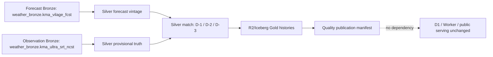

# Weather Forecast-Quality Gold Architecture

## Boundary

This internal, replayable product measures forecast accuracy against observed Seoul weather.
It is not a user-facing forecast product. D1, Worker, and the existing public serving
publication path remain unchanged.

The graph has no KMA collection task. It reads already-persisted Iceberg Bronze partitions
and writes only quality Silver/Gold Iceberg tables plus the quality publication manifest in
the configured R2-backed catalog. It has no D1 or Worker write, asset, selector, or dependency edge.

## Time and data-quality contract

Each run covers seven complete KST dates ending yesterday; today's partial KST date is forbidden.
Every run freezes `evaluation_as_of` and `evaluation_run_id`, so later repairs cannot rewrite
an earlier historical interpretation.

| Horizon | Inclusive issue-time window | Variables |
|---|---|---|
| D-1 | `[valid_at - 27h, valid_at - 24h]` | TMP, POP, PTY |
| D-2 | `[valid_at - 51h, valid_at - 48h]` | TMP, POP, PTY |
| D-3 | `[valid_at - 75h, valid_at - 72h]` | TMP, POP, PTY |

The cohort is exactly 80 canonical KMA grids, not the separate 427-place serving reference.
TMP is continuous; POP is percent-to-probability normalized and positive at `>= 0.5`; PTY is categorical.
Observation truth is **provisional** in version 1. Otherwise-complete provisional metrics are
**degraded**. Results are `insufficient_evidence` below 30 samples or 80 percent coverage.
Missing forecast/truth, invalid input, and incompatible contracts remain explicit match states.

## Publication and resources

Gold history is run-versioned and partitioned by evaluation date. Latest views select only
manifest `SUCCESS`; failed or interrupted candidates stay invisible. Seven-date expected counts are
120,960 grid rows, 504 hourly rows, and 21 daily rows. One-date replay counts are 17,280, 72, and 3.
The success marker follows exact count reconciliation and an expected-population anti-join for grid,
hourly, and daily keys, making DAG retries at-least-once but
publication identity idempotent.

Transform, reference refresh, serving snapshot, maintenance, and quality work share one
single-slot `trino_weather_heavy` lane. Quality work uses priority 10, 15m task/query limits,
and a 20m DAG-run limit. Partition-bounded source reads reduce OOM risk and enable filesystem-cache reuse.

The default schedule is blank; both DAGs are paused on creation. The intended post-approval schedule is
`5 3 * * *` (`03:05 KST`) through `ASK_SEOUL_WEATHER_QUALITY_DAG_SCHEDULE`. The backfill DAG is manual only.
