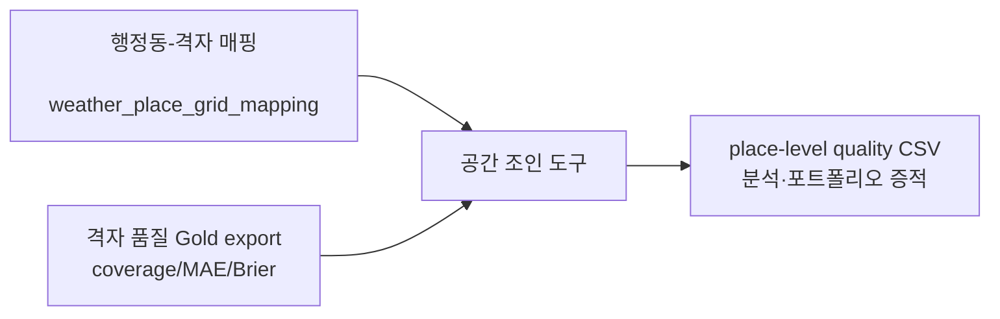

# 예보 품질 공간 데이터 제품

Forecast-Quality Gold의 격자별 결과를 행정동 단위로 조회할 수 있게 만드는 내부
분석 제품이다. 공개 날씨 서비스의 응답 계약을 바꾸지 않고, 기존 `place_id`와
기상청 격자 사이의 검증된 매핑을 재사용한다.



## 데이터 계약

- 식별자: `place_id`, `grid_id`, `evaluation_date_kst`, `forecast_horizon`
- 공간 기준: 기존 crosswalk의 위도·경도, 행정동·구, 격자 거리·매핑 방법
- 품질 기준: `matched_coverage`, 기온 MAE, 강수 Brier score, PTY 정확도, 증거 상태
- 관측 truth가 provisional/degraded이면 공간 결과도 해당 상태를 그대로 전달한다.
- 매핑되지 않은 품질 행을 임의의 장소에 배정하지 않는다. 반대로 품질 지표가 없는
  장소는 `NO_METRICS`로 남겨 커버리지 공백을 숨기지 않는다.

## 재현 명령

```bash
python -m tools.spatial_quality_product \
  --mapping dbt/domains/traffic_weather/seeds/weather/weather_place_grid_mapping.csv \
  --metrics /tmp/forecast-quality-grid.csv \
  --output /tmp/place-quality.csv
```

이 산출물은 상용 부동산·유동인구 데이터가 아니다. 실제 외부 데이터를 결합할
때에는 출처, 사용 권한, 기준 시각, 공간 단위, 결측 처리 규칙을 별도 데이터
계약으로 고정해야 한다.
