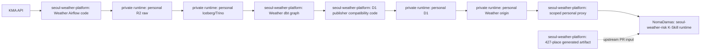

# Platform Boundaries

이 문서는 `seoul-weather-platform`이 소유하는 공개 코드 경계와 개인 runtime 경계를 구분한다.

## 현재 판정

현재 경계는 **public Weather code plane + private personal operations plane + upstream K-Skill runtime**이다.

이유:

- Weather 코드와 계약은 한 저장소에서 같이 검증해야 한다.
- R2/D1/origin은 Mason의 개인 Cloudflare 계정으로 이관됐지만 자격증명과 데이터는 public repository 소유물이 아니다.
- K-Skill runtime을 vendoring하면 upstream 설치본과 drift가 생긴다.
- 기본 NomaDamas proxy의 조직 origin은 이 저장소가 바꿀 수 없으므로 개인 proxy Worker가 명시적 routing seam을 제공한다.

## Runtime ownership seam

## 소유권 표

| 영역 | 1차 소유자 | 이 저장소의 역할 | 완료 주장 |
|---|---|---|---|
| Weather DAG code | `seoul-weather-platform` | fixed-SHA snapshot과 secretless test 관리 | L0 가능 |
| Weather dbt graph | `seoul-weather-platform` | 4 public product와 private availability companion 관리 | L0 가능 |
| D1 publisher compatibility | `seoul-weather-platform` | atomic publish/LKG/availability invariant 보존 | L0 가능 |
| Personal R2/Iceberg/Trino | Mason private operations | 개인 계정 read/write runtime | 운영 승인·비밀값 필요 |
| Personal D1/origin | Mason private operations | publication과 read-only origin | 운영 승인·비밀값 필요 |
| Personal K-Skill proxy | `seoul-weather-platform` | 3개 route allowlist, secret forwarding, rate limit | 코드·배포 검증 가능 |
| K-Skill runtime | `NomaDamas/k-skill` | artifact handoff와 proxy contract fixture 제공 | upstream 소유 |

## 배포 전 stop condition

다음 중 하나라도 해당하면 repository 검증에서 멈춘다.

- source snapshot provenance가 깨졌다.
- Weather public product exact set 4개가 깨졌다.
- `seoul-weather-risk` 노출 제품 1개 경계가 깨졌다.
- 427-place artifact가 deterministic하지 않다.
- Airflow 배포·DAG 실행·기존 storage write가 필요하지만 사용자 승인이 없다.
- 기존 resource owner와 유지 기간이 확인되지 않았다.

## 정상 운영 순서

1. 개인 target identity와 secret injection 검증
2. Bronze → Silver → Gold 멱등 갱신
3. D1 atomic publication과 last-known-good 보존
4. 개인 origin contract smoke
5. 개인 proxy를 통한 K-Skill live query
6. freshness watchdog와 Docker OOM/restart 관측
