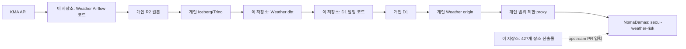

# 플랫폼의 소유권과 실행 경계

이 문서는 `seoul-weather-platform`이 관리하는 코드와 개인 운영 환경,
upstream K-Skill 실행 환경을 나눠 설명한다.

## 한 줄 결론

현재 구조는 **공개 Weather 코드 + 개인 운영 환경 + upstream K-Skill** 세 영역이다.

- 코드와 계약은 이 저장소에서 함께 검사한다.
- 개인 R2·D1·origin은 Mason 개인 Cloudflare 계정에 있고 비밀값은 공개하지 않는다.
- K-Skill 실행 코드를 이 저장소에 복사하지 않고 `NomaDamas/k-skill`을 정본으로 둔다.
- 개인 proxy Worker가 Weather origin과 K-Skill 사이의 명시적인 연결 지점이다.

## 데이터 흐름

## 영역별 주인과 역할

| 영역 | 주인 | 이 저장소의 역할 | 현재 가능한 주장 |
|---|---|---|---|
| Weather DAG | `seoul-weather-platform` | 고정 커밋 코드와 비밀값 없는 검사 | 코드 검사 완료 |
| Weather `dbt` | `seoul-weather-platform` | 네 제품과 내부 품질 제품 관리 | 코드 검사 완료 |
| D1 발행 호환 코드 | `seoul-weather-platform` | 원자 발행·최신 정상본 규칙 보존 | 계약 검사 가능 |
| 개인 R2/Iceberg/Trino | Mason 개인 운영 | 원본·테이블·쿼리 실행 | 운영 승인과 비밀값 필요 |
| 개인 D1/origin | Mason 개인 운영 | 제품 발행과 읽기 전용 응답 | 운영 승인과 비밀값 필요 |
| 개인 K-Skill proxy | `seoul-weather-platform` | 세 경로 허용, 토큰 전달, 호출 제한 | 코드·배포 검사 가능 |
| K-Skill 실행 환경 | `NomaDamas/k-skill` | 장소 산출물과 proxy 계약 전달 | upstream 주인 |

## 배포 전 중단 조건

다음 중 하나라도 맞으면 저장소 검사에서 멈춘다.

- 원본 출처 목록과 파일 지문이 맞지 않다.
- 공개 Weather 제품이 정확히 네 개가 아니다.
- `seoul-weather-risk`가 공개하는 제품이 하나라는 경계가 깨졌다.
- 427개 장소 산출물이 같은 입력에서 항상 같은 결과를 만들지 못한다.
- Airflow 실행이나 기존 저장소 쓰기가 필요한데 승인이 없다.
- 개인 리소스 주인과 보존 기간을 확인하지 못했다.

## 정상 운영 순서

1. 개인 대상과 비밀값 주입 방식을 읽기 전용으로 확인한다.
2. Bronze → Silver → Gold를 같은 입력에서 멱등적으로 갱신한다.
3. D1을 원자적으로 발행하고 마지막 정상 발행본을 보존한다.
4. 개인 origin 응답 계약을 읽기 전용으로 확인한다.
5. 개인 proxy를 통해 K-Skill 조회를 확인한다.
6. 최신 시각, Docker 메모리, 재시작, 감시 작업을 계속 관측한다.
