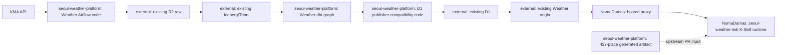

# Platform Boundaries

이 문서는 `seoul-weather-platform`이 소유하는 코드 경계와 1차에서 계속 외부 의존성으로 남는 runtime 경계를 구분한다.

## 현재 판정

최적 경계는 **개인 private vertical monorepo + 기존 storage 임시 사용 + K-Skill upstream runtime 유지**다.

이유:

- Weather 코드와 계약은 한 저장소에서 같이 검증해야 한다.
- 기존 R2/D1/origin은 프로젝트 종료 후 권한 회수 리스크가 있으므로 소유 경계로 보면 안 된다.
- K-Skill runtime을 vendoring하면 upstream 설치본과 drift가 생긴다.
- 개인 R2/D1 이관은 data copy/replay/rollback까지 포함하므로 repository split과 같은 PR에 묶지 않는다.

## Runtime ownership seam

## 소유권 표

| 영역 | 1차 소유자 | 이 저장소의 역할 | 완료 주장 |
|---|---|---|---|
| Weather DAG code | `seoul-weather-platform` | fixed-SHA snapshot과 secretless test 관리 | L0 가능 |
| Weather dbt graph | `seoul-weather-platform` | 4 public product와 private availability companion 관리 | L0 가능 |
| D1 publisher compatibility | `seoul-weather-platform` | atomic publish/LKG/availability invariant 보존 | L0 가능 |
| Existing R2/Iceberg/Trino | 기존 ASK Seoul 환경 | 외부 의존성으로 read/write 검증 가능 | L1 승인 필요 |
| Existing D1/origin | 기존 ASK Seoul 환경 | publication/runtime smoke 대상 | L1 승인 필요 |
| Hosted proxy/K-Skill runtime | `NomaDamas/k-skill` | artifact handoff와 contract fixture 제공 | upstream PR 필요 |
| Personal R2/D1/origin | 미생성 | 후속 독립 운영 milestone | L2 별도 설계 |

## 배포 전 stop condition

다음 중 하나라도 해당하면 repository 검증에서 멈춘다.

- source snapshot provenance가 깨졌다.
- Weather public product exact set 4개가 깨졌다.
- `seoul-weather-risk` 노출 제품 1개 경계가 깨졌다.
- 427-place artifact가 deterministic하지 않다.
- Airflow 배포·DAG 실행·기존 storage write가 필요하지만 사용자 승인이 없다.
- 기존 resource owner와 유지 기간이 확인되지 않았다.

## 후속 독립 운영 순서

1. 개인 R2/Iceberg/D1 생성과 권한 검증
2. raw data checksum copy 또는 KMA 재수집 결정
3. Bronze → Silver → Gold replay
4. 개인 D1 publication adapter 배포
5. slim Weather origin 배포
6. hosted proxy shadow comparison
7. upstream origin 전환 PR과 rollback 계획
8. 기존 credential/resource 의존성 폐기
