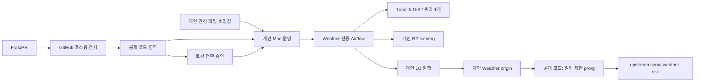

# 공개 코드와 개인 운영 환경의 경계

Weather 플랫폼은 공개해도 되는 코드 영역과 Mason만 접근하는 운영 영역으로 나눈다.
저장소를 공개한다고 해서 개인 노트북, Cloudflare 계정, KMA 키, Airflow 기록에
접근할 수 있게 되면 안 된다.

## 각 영역에 둘 수 있는 것

| 영역 | 넣을 수 있는 것 | 넣으면 안 되는 것 |
|---|---|---|
| 공개 코드 | Weather DAG·`dbt`·계약·검사·고정 의존성·비밀값 없는 예시 파일·설계 문서 | 값이 채워진 환경 파일, 계정·버킷 ID, 토큰, host 경로, Docker volume, Airflow 기록·로그 |
| 개인 Mac 운영 | 실제 `weather-platform.prod.env`, Docker 상태, Airflow 기록·로그, 승인·되돌리기 자료 | 커밋, 배포 산출물, Actions 기록, 외부 fork가 쓸 수 있는 실행기 상태 |
| 개인 Cloudflare 데이터 | R2 원본/Iceberg, Data Catalog, D1 제품 테이블, Worker | CI 키, fork 키, 저장소 공개 여부를 바꾸는 권한 |

Weather origin 자체는 별도 제공 시스템이다. 이 저장소가 관리·배포하는 것은
`k-skill-proxy/`의 좁은 연결부뿐이며, upstream 서비스 토큰은 Worker secret으로 둔다.

## 신뢰 경계와 통제

1. PR과 fork 검사는 GitHub 호스팅의 읽기 전용·비밀값 없는 작업만 사용한다.
   `pull_request_target`은 쓰지 않고 개인 Mac을 self-hosted runner로 등록하지 않는다.
2. 로컬 Docker/Airflow 변경은 `AGENTS.md` 사전 보고와 명시 승인이 있어야 한다.
3. 활성화 직전에 개인 계정의 R2 버킷과 D1 데이터베이스가 맞는지 범위가 제한된 읽기로
   확인한다. 호스트 이름만 같다고 같은 계정으로 판단하지 않는다.
4. 분리된 Compose 공간, 일시정지 DAG, 메모리 여유, 되돌리기 경로를 증명한 뒤에만 외부
   쓰기를 연다. 첫 쓰기는 좁은 범위와 멱등 규칙을 따른다.
5. Marquez/OpenLineage를 끈 뒤에도 파일 기반 `provenance`와 고정 커밋 지문으로 출처를
   추적한다.

## 공개 전환 확인 결과

2026-08-21에 공개 전환을 승인했고, 2026-08-22에 읽기 전용 확인을 다시 했다.

- 저장소 공개 상태: `PUBLIC`
- 기본 브랜치: `main`
- 배포 변수: `WEATHER_DEPLOYMENT_ENABLED=disabled`
- 거버넌스 모드: `WEATHER_GOVERNANCE_MODE=public`
- 등록된 저장소 runner: 0개
- `main` 보호 규칙: `CI / required`와 PR 검토 필요
- GitHub Release와 내려받을 수 있는 산출물: 0개

이 결과는 확인 당시의 증거일 뿐, 앞으로의 배포 허가가 아니다. 저장소 코드 변경이나
workflow가 공개 여부를 자동으로 바꾸지 못하게 유지한다.

## 현재 결정

공개 코드와 호스팅 CI는 사용하고, 실제 Docker·Airflow·Trino·R2·D1·origin·proxy
변경은 개인 운영 영역에 남긴다. 매번 대상 확인과 승인을 거친다.

## 공개 검사기가 확인하는 원문 표식

다음 문구는 공개 전환 당시의 검사 결과와 연결되는 고정 표식이다.

- `disabled manual no-op deploy workflow is hosted-only and inert`
- `hosted-only CI has no self-hosted route`
- `repository is public`
- `` `CI / required` branch protection is active ``
