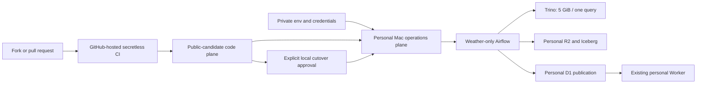

# Public code / private operations architecture

## Decision

The Weather platform is split into a public-candidate code plane and a private
personal operations plane. Repository visibility is not an operational deploy
switch, and making the repository public must never grant a fork, workflow, or
runner access to Mason's Mac, Cloudflare account, KMA credential, or Airflow
metadata.

## Plane ownership

| Plane | May contain | Must not contain |
|---|---|---|
| Public-candidate code | Weather DAGs, dbt models, contracts, unit tests, pinned dependencies, secretless `.env.example`, architecture and operational runbooks | Populated env files, account/database/bucket identifiers, tokens, host paths, Docker volumes, Airflow metadata/logs, deployment approval artifacts |
| Private Mac operations | Populated `weather-platform.prod.env`, Docker Desktop state, Airflow metadata/logs, local approval and rollback evidence | Repository commits, release assets, Actions artifacts, fork-accessible runner state |
| Personal Cloudflare data | R2 raw/Iceberg data, Data Catalog metadata, D1 serving tables, existing Worker | CI credentials, fork credentials, repository visibility control |

The existing Worker deployment is an external serving boundary. This repository
validates its read-only API contract but does not deploy or mutate the Worker.

## Trust boundaries and controls

1. Pull requests and forks run only GitHub-hosted, read-only, secretless checks.
   `pull_request_target` is prohibited. A public repository never registers the
   personal Mac as a self-hosted runner.
2. Local Docker/Airflow mutation requires the approval report in `AGENTS.md`.
   Repository tests, a passing public-readiness report, or a merge do not imply
   deployment approval.
3. Personal Cloudflare target identity is checked immediately before activation
   using redacted resource-scoped readbacks. A host match is insufficient; the
   configured R2 bucket and D1 database must belong to the intended account.
4. External writes begin only after the isolated Compose namespace, paused DAG
   state, memory headroom, and rollback path are proved. First-run writes are
   idempotent and narrowly scoped to Weather.
5. Provenance remains file-based after runtime OpenLineage/Marquez retirement.
   Handoff inputs retain a non-secret SHA-256 inventory and derived changes keep
   validators and source attribution.

## Public visibility gate

Repo-local publication gates now pass for the reviewed tree:

- redistribution rights for imported/derived material are recorded in
  `provenance/source-files.jsonl`;
- an authorized Apache-2.0 `LICENSE` and required notices are present;
- hosted-only CI has no self-hosted route;
- the disabled manual no-op deploy workflow is hosted-only and inert;
- prior audit evidence recorded 0 GitHub Releases, 0 downloadable Release
  artifacts, 121 GitHub Actions logs scanned clean, and a reachable-object scan
  that passed at its audit point.

The user authorized the full visibility cutover on 2026-08-21. The external
GitHub cutover remains pending until a fresh public-readiness preflight,
repository variables disabled/public readback, exact offline runner removal, PR
CI and merge, public visibility readback, post-public branch protection readback,
and a fresh delta/full scan immediately before visibility.

A readiness PASS is evidence, not authorization. No repository script or workflow
is allowed to change visibility.

## Current disposition

The architecture disposition is current: repo-local publication gates are
`PASS`, while GitHub external visibility cutover is `PENDING`.
Public visibility has not yet been applied.
Branch protection has not yet been applied after public visibility.
Runtime operations remain private and require separate local approval before any
Docker, Airflow, Trino, R2, D1, or Worker-affecting mutation.
