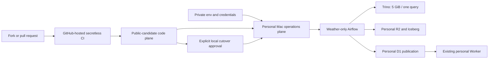

# Public code / private operations architecture

## Decision

The Weather platform is split into a public-candidate code plane and a private
personal operations plane. Repository visibility is not an operational deploy
switch, and making the repository public must never grant a fork, workflow, or
runner access to Mason's Mac, Cloudflare account, KMA credential, or Airflow
metadata.

## Plane ownership

| Plane | May contain | Must not contain |
|---|---|---|
| Public-candidate code | Weather DAGs, dbt models, contracts, unit tests, pinned dependencies, secretless `.env.example`, architecture and operational runbooks | Populated env files, account/database/bucket identifiers, tokens, host paths, Docker volumes, Airflow metadata/logs, deployment approval artifacts |
| Private Mac operations | Populated `weather-platform.prod.env`, Docker Desktop state, Airflow metadata/logs, local approval and rollback evidence | Repository commits, release assets, Actions artifacts, fork-accessible runner state |
| Personal Cloudflare data | R2 raw/Iceberg data, Data Catalog metadata, D1 serving tables, existing Worker | CI credentials, fork credentials, repository visibility control |

The existing Worker deployment is an external serving boundary. This repository
validates its read-only API contract but does not deploy or mutate the Worker.

## Trust boundaries and controls

1. Pull requests and forks run only GitHub-hosted, read-only, secretless checks.
   `pull_request_target` is prohibited. A public repository never registers the
   personal Mac as a self-hosted runner.
2. Local Docker/Airflow mutation requires the approval report in `AGENTS.md`.
   Repository tests, a passing public-readiness report, or a merge do not imply
   deployment approval.
3. Personal Cloudflare target identity is checked immediately before activation
   using redacted resource-scoped readbacks. A host match is insufficient; the
   configured R2 bucket and D1 database must belong to the intended account.
4. External writes begin only after the isolated Compose namespace, paused DAG
   state, memory headroom, and rollback path are proved. First-run writes are
   idempotent and narrowly scoped to Weather.
5. Provenance remains file-based after runtime OpenLineage/Marquez retirement.
   Handoff inputs retain a non-secret SHA-256 inventory and derived changes keep
   validators and source attribution.

## Public visibility gate

Visibility remains private unless every item below passes in one fresh review:

- redistribution rights for all imported/derived material are evidenced, or the
  blocked material is replaced clean-room;
- an authorized `LICENSE` and required notices are present;
- the complete Git object history and every GitHub Release body/asset have passed
  redacted secret and local-path scans;
- all CI used by forks is GitHub-hosted, read-only, action-SHA-pinned, and
  secretless;
- the legacy self-hosted runtime job and `deploy-main` path are disabled or moved
  to a separately private operations repository, with GitHub readback evidence;
- branch protection, required checks, CODEOWNERS, SECURITY, and contribution
  policy are configured;
- the user receives the final evidence report and separately approves the
  `PRIVATE -> PUBLIC` change.

A readiness PASS is evidence, not authorization. No repository script or workflow
is allowed to change visibility.

## Current disposition

The architecture is ready for incremental hardening, but publication is
`BLOCKED`. Three fixed sources are classified `internal_private_snapshot_only`,
there is no authorized root license, full history/Release scans have not yet been
completed, and the legacy self-hosted/deployment workflows must be retired before
visibility changes.
