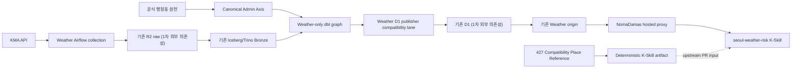

# Seoul Weather Platform 저장소 분리 최종 설계

> 사람용 안내: 공개 코드와 개인 운영 환경을 나눈 최종 설계다. 명령어·경로·상태 값은
> 실제 계약과 대조해야 하므로 원래 표기를 유지한다.

## 0. 문서 상태와 최종 판정

- 작성일: 2026-08-14
- 대상 저장소: `masondev1024/seoul-weather-platform`
- 저장소 공개 범위: private
- 개발 기준 브랜치: `dev`
- 설계 대상: ASK Seoul의 Weather 수집·변환·게시·K-Skill 연계 수직 slice
- 1차 목표: 기존 저장소를 그대로 사용하는 동안 Weather 코드를 개인 저장소로 안전하게 분리하고, 후속 인프라 독립을 준비한다.

최종 critic 판정은 **조건부 승인(ACCEPT WITH GATES)** 이다.

개인 private 저장소에 Weather vertical monorepo를 만들고, 고정 SHA의 clean snapshot만 이관하는 방향은 현재 조건에서 최적안이다. 단, 다음 조건을 모두 지켜야 한다.

1. 저장소 분리와 운영 인프라 이전을 같은 작업으로 취급하지 않는다.
2. Airflow가 기대하는 `dbt/domains/traffic_weather` 경로와 dbt project name `asac_seoul`을 1차에서 유지한다.
3. D1에 게시되는 Weather 제품 4개와 현재 K-Skill이 노출하는 제품 1개를 구분한다.
4. `common/serving`의 원자적 게시, last-known-good, query-availability 불변식은 보존한다.
5. 모든 이관 파일은 고정 원본 SHA와 content checksum으로 추적한다.
6. 기존 R2·Iceberg·Trino·D1·origin은 임시 외부 의존성으로만 사용하며 credential을 복사하지 않는다.
7. 원본 DAG·DBT·Serving 저장소의 재사용 권리가 확인되기 전에는 외부 공개 또는 제3자 재배포를 하지 않는다.

## 1. 이 설계가 해결하는 것과 해결하지 않는 것

### 1.1 이번 분리로 해결하는 것

- Weather 파이프라인 코드를 Traffic과 분리된 개인 저장소에서 관리한다.
- 고정된 원본 commit에서 재현 가능한 source snapshot을 만든다.
- KMA 수집부터 dbt Weather 제품, D1 게시 호환 코드, K-Skill 장소 artifact까지 한 저장소에서 변경 영향도를 확인한다.
- Traffic·Citydata 등 다른 도메인 코드 없이 Weather graph와 계약을 검증한다.
- 향후 개인 R2·D1로 이전할 때 사용할 명확한 경계와 검증 기준을 만든다.

### 1.2 이번 분리만으로 해결되지 않는 것

- 개인 R2·D1·Iceberg catalog 생성
- 기존 raw/object/table 데이터 이관
- 개인 KMA credential 확보와 운영 수집 전환
- 개인 Airflow scheduler 운영
- 개인 Weather origin 또는 hosted proxy origin 전환
- 기존 팀 인프라의 존속·접근 권한 보장

따라서 1차 완료의 정확한 표현은 **운영 독립 완료가 아니라 운영 독립 준비 완료**다.

## 2. 용어와 정본 경계

| 용어 | 의미 | 정본 범위 |
|---|---|---|
| Source Snapshot | 고정된 upstream commit에서 추출한 파일 bytes | 이관 입력의 정본 |
| Generated Artifact | 새 저장소가 결정적으로 생성한 장소 JSON·checksum·release manifest | upstream PR에 넣을 배포 후보 |
| Contract Fixture | API shape, cursor, 오류, valid-empty 의미를 고정한 테스트 자료 | 계약 검증 자료이며 runtime 구현은 아님 |
| Platform Product | dbt가 생산하고 D1 publisher가 게시하는 Weather 데이터 제품 | `seoul-weather-platform`이 관리 |
| K-Skill Product | 현재 `seoul-weather-risk` skill이 사용자에게 노출하는 제품 | `NomaDamas/k-skill`이 runtime 정본 |
| Compatibility Place Reference | K-Skill과 기존 Weather serving이 사용하는 427개 장소 reference | `weather_place_grid_mapping.csv` 기반 |
| Canonical Admin Axis | 공공 원천에서 주기적으로 갱신하는 공식 행정동 축 | common admin-dong pipeline이 관리 |
| Admin Grid Bridge History | canonical 행정동과 KMA grid의 시점별 연결 증거 | append-only bridge evidence |
| Publication Evidence | publication·freshness·coverage·availability를 증명하는 metadata | dbt companion + publisher sidecar |

private 공개 범위는 접근 제어일 뿐 코드와 데이터의 재사용 권리를 부여하지 않는다.

## 3. 고정 원본

| 영역 | 원본 | 기준 ref | 기준 SHA | 용도 |
|---|---|---|---|---|
| Airflow Weather | `ASAC-DE-bigkk/ASAC-DAG` | `origin/dev` | `73ff5665ffd5526c59de8be2969cf65dffaf468b` | Weather 수집·변환·게시 DAG |
| Weather dbt | `ASAC-DE-bigkk/ASAC-DBT` | `origin/dev` | `a64292d50bd8c2a19784388828de38d2b4a8c525` | Weather model·seed·test·contract |
| Origin 계약 | `ASAC-DE-bigkk/ASK-Seoul-Serving` | `origin/dev` | `efe393e7a925d5798867424993daf0dbe5d55902` | Weather Risk origin API 계약 |
| K-Skill runtime | `NomaDamas/k-skill` | `upstream/dev` | `43edf3c0f1037a4e510b21de61e26965212b6620` | skill·hosted proxy·장소 artifact 호환 기준 |

확인된 사실:

- 네 SHA는 2026-08-14 현재 로컬 git object로 모두 존재한다.
- 기존 DAG·DBT checkout은 dirty하거나 다른 branch일 수 있으므로 working tree를 복사하지 않는다.
- `ASK-Seoul-Serving` checkout은 `C:/Users/Dell3571/Desktop/Projects/ASK-Seoul-Serving`에 존재한다.
- DAG·DBT 원본 root에는 명시적인 `LICENSE` 파일이 확인되지 않았다.
- k-skill root는 MIT이고 proxy package는 별도 AGPL-3.0 경계를 가진다. K-Skill runtime 코드를 새 저장소로 vendoring하지 않는다.

원본 갱신은 자동으로 latest를 따라가지 않는다. 새 SHA를 반영할 때마다 source lock, inventory, checksum, contract test를 같은 PR에서 갱신한다.

## 4. 목표 아키텍처



코드 소유 경계는 하나의 private vertical monorepo로 모으되, runtime 소유 경계는 그대로 유지한다.

- 새 저장소: Weather pipeline, dbt products, publisher compatibility code, 계약 fixture, artifact generator
- 기존 팀 인프라: 1차의 R2·Iceberg·Trino·D1·origin
- NomaDamas upstream: hosted proxy와 설치되는 K-Skill runtime

## 5. 제품과 계약 매핑

### 5.1 Platform Product와 K-Skill Product

| product_id | dbt producer | D1 public | 현재 `seoul-weather-risk` 노출 | 비고 |
|---|---|---:|---:|---|
| `weather_place_current_outlook` | `gold_weather_place_current_outlook` | 예 | 아니오 | 현재 상태 요약 |
| `weather_place_precipitation_window` | `gold_weather_place_precipitation_window` | 예 | 아니오 | 강수 예상 구간 |
| `weather_place_risk_window` | `gold_weather_place_risk_window` | 예 | 예 | 현재 K-Skill 단일 제품 |
| `weather_place_forecast_change_daily` | `gold_weather_place_forecast_change_daily` | 예 | 아니오 | 일 단위 예보 변화 |

`weather_place_forecast_change_daily`와 최신 Serving의 `query_context`·422 계약은 고정 SHA에 실제로 존재한다. 이들을 없애라는 일부 critic 의견은 stale working tree를 근거로 했으므로 채택하지 않는다.

### 5.2 내부 relation

최소 graph는 다음 계보를 보존한다.

```text
weather_bronze.kma_vilage_fcst
  → silver_kma_vilage_fcst
  → silver_weather_forecast_by_admin_dong_serving
  → gold_weather_forecast_by_place_serving
  → gold_weather_place_hourly_outlook
  → four public Weather products
```

추가로 private companion `gold_weather_place_risk_query_availability`를 유지한다. 공개 제품으로 세지 않는다.

`gold_weather_place_hourly_outlook`은 `(place_id, forecast_at)`마다 최신 `issued_at` 하나만 선택해야 한다. 이 규칙과 관련 unit/singular test는 반드시 이관한다.

### 5.3 Query availability sidecar

dbt companion이 다음 content column을 생산한다.

- `place_id`
- `snapshot_as_of_hour`
- `available_from_at`, `available_to_at`
- `forecast_collected_at_min`, `forecast_collected_at_max`
- `expected_forecast_hour_count`, `observed_forecast_hour_count`
- `availability_status`
- `source_population_revision`

publisher가 다음 publication column을 추가해 `d1_product_query_availability`에 저장한다.

- `product_id`, `publication_id`
- `availability_fingerprint`
- `measured_at`

primary key는 `(product_id, publication_id, place_id)`다. Serving은 이 sidecar를 읽어 요청 범위가 검증 가능한지 판단한다.

## 6. 목표 저장소 구조

```text
seoul-weather-platform/
├─ AGENTS.md
├─ CONTEXT.md
├─ pyproject.toml
├─ runtime/
│  ├─ toolchain.lock.json
│  ├─ requirements-airflow.lock.txt
│  ├─ requirements-dbt.lock.txt
│  └─ profiles.example.yml
├─ dags/
│  ├─ common/                         # Weather import closure
│  │  └─ serving/                     # atomic publish/LKG/availability invariants
│  ├─ common_admin_dong_bronze.py      # canonical admin axis lane
│  └─ domains/weather/                 # selected Weather DAG lanes + tests
├─ dbt/
│  ├─ domains/traffic_weather/         # 1차 경로 호환 seam
│  │  ├─ dbt_project.yml               # name: asac_seoul 유지
│  │  ├─ packages.yml
│  │  ├─ profiles.yml
│  │  ├─ selectors.yml
│  │  ├─ macros/
│  │  ├─ models/weather/
│  │  ├─ seeds/weather/
│  │  └─ tests/weather/
│  ├─ packages/asac_axes/              # 1차에는 16-file package 전체 pin
│  └─ serving_contract/                # static meta.serving validator
├─ contracts/
│  ├─ origin/weather-risk/             # ASK-Seoul-Serving 3-route 계약
│  └─ hosted-proxy/weather-risk/       # NomaDamas public proxy 계약
├─ release/weather/
│  ├─ generate_place_artifact.py
│  ├─ validate_place_artifact.py
│  ├─ upstream-handoff.json
│  └─ snapshots/
├─ provenance/
│  ├─ source-refs.lock.json
│  ├─ source-inventory.json
│  └─ source-files.jsonl
├─ tests/repository/
├─ tools/
│  ├─ export_snapshot.ps1
│  ├─ verify_provenance.py
│  └─ verify_repository.ps1
└─ docs/
   ├─ architecture/
   ├─ operations/current-resource-dependencies.md
   └─ superpowers/specs/
```

`dbt/domains/traffic_weather`라는 이름은 Traffic model을 유지한다는 뜻이 아니다. 기존 Airflow 기본 경로 `/opt/airflow/dbt/domains/traffic_weather`와 dbt unique id `model.asac_seoul.*`를 깨지 않기 위한 1차 compatibility seam이다. 이름 변경은 별도 migration PR에서 manifest·lineage·DAG 기본값·테스트를 함께 바꾼다.

## 7. 코드 이관 범위

### 7.1 Airflow Weather lanes

포함한다.

1. KMA 단기예보 collection·checkpoint·raw manifest·Bronze load
2. Weather W1/W2 canonical transform과 dbt execution
3. 공식 행정동 주간 sync와 필요한 common helper
4. Weather serving snapshot refresh·export·freshness watchdog
5. 위 DAG가 실제 import하는 `common` dependency closure
6. failure callback, redaction, runtime guard, run metrics, storage/http helper
7. 해당 unit/import test

제외한다.

- Traffic DAG와 Traffic pool 전용 코드
- Weather+Traffic mixed maintenance DAG
- `weather_traffic_cost_proxy` 및 delivery-reliability 실험
- Citydata POI bridge와 타 도메인 asset
- 로컬 harness 전용 deploy script와 개인 기록

`common/` 전체를 무조건 복사하지 않는다. 다만 `common/serving`은 고정 SHA에서 24개 파일로 확인되는 응집된 publisher slice이고 Weather serving DAG가 직접 의존하므로 함께 이관한다. 24라는 개수는 참고 evidence이며 allowlist 자체는 아니다. exact 파일 목록은 `weather_serving_export.py`, `weather_serving_freshness_watchdog.py`, `weather_serving_snapshot_refresh.py`를 root로 한 import graph와 `common/serving/**`의 test·fixture 포함 여부를 `provenance/source-inventory.json`에 고정한다. 일반 Marketplace Worker 코드는 여기에 포함되지 않는다.

### 7.2 dbt Weather graph

고정 DBT SHA에서 네 public product와 private companion의 transitive `ref`, `source`, macro, seed, unit/singular test closure를 추출한다.

1차에는 `dbt/packages/asac_axes` 16개 파일을 통째로 pin한다. 이 package에는 고정 SHA 기준 Traffic ref가 없고, 일부 macro만 골라내는 작업을 저장소 분리와 동시에 하면 두 종류의 변경을 한 번에 검증해야 하기 때문이다. `dbt/domains/traffic_weather/packages.yml`의 `local: ../../packages/asac_axes` 참조를 그대로 유지하며, `dbt deps` 결과인 `dbt_packages/`는 generated output으로 추적하지 않는다. package 최소화는 parse·result equivalence를 확보한 후 별도 PR로 진행한다.

원본 broad selector가 retained grid audit까지 포함할 수 있으므로 target repo의 `selectors.yml`에는 local-authored exact selector `ask_seoul_weather_d1_public_products`를 추가한다. 이 selector는 네 public producer를 명시적으로 열거하고, exact-set repository test가 같은 네 모델 외 추가 relation을 허용하지 않는다.

제외한다.

- `models/traffic/**`
- `gold_weather_x_*`
- Transit·Culture·Commerce·Citydata source
- Citydata POI bridge
- mixed collection cost/ops model
- generated `target`, `logs`, `dbt_packages`

### 7.3 Publication compatibility lane

다음은 보존한다.

- static `meta.serving` contract validator
- Weather 4-product allowlist
- atomic staging/activation/compensation
- last-known-good 보존
- query-availability sidecar staging/readback
- content identity와 publication fingerprint
- freshness watchdog
- 네트워크 없이 실행되는 publisher/D1 fake unit test

다음은 이관하지 않는다.

- Marketplace `/api/v1` router
- UI, OAuth, user key 발급, quota, MCP, 일반 catalog
- 기존 Cloudflare credential과 account/database binding
- 개인 D1을 위한 새 adapter 구현

1차에서는 코드를 보존하고 secretless test를 수행하지만 새 저장소에서 production 배포를 실행하지 않는다. 기존 저장소에 대한 실제 publication은 별도 L1 통합 검증 승인을 받아야 한다.

## 8. API 계약 경계

### 8.1 ASK Seoul origin

```text
GET /skill/v1/bundles/seoul-weather-risk
GET /skill/v1/products/weather_place_risk_window
GET /skill/v1/products/weather_place_risk_window/data
```

### 8.2 NomaDamas hosted proxy

```text
GET /v1/ask-seoul/weather-risk/bundle
GET /v1/ask-seoul/weather-risk/product
GET /v1/ask-seoul/weather-risk/data
```

full query는 bundle → product → data를 사용하고, K-Skill fast path는 data 한 번만 호출한다. 두 계층의 route를 같은 계약으로 섞지 않는다.

fixture가 고정해야 할 동작:

- `place_id` 한 개 필수
- `from`과 `to` 동시 입력 또는 동시 생략
- KST/RFC3339 canonical window 정규화
- availability 범위 밖 요청의 `422 query_window_unavailable`
- `query_context.schema_version == "weather-risk-query-context/v1"`
- cursor v2가 publication·place·canonical window/query fingerprint에 결속
- `409 cursor_query_mismatch`와 expired cursor
- `503 product_not_ready`, `429`, `401`, `403`, `404`, `400`, redacted `500`
- 정상 0행과 데이터 미준비를 구분
- `--fast`가 metadata route 없이 data route만 호출
- `--fast --filter`가 fail-closed

fixture 통과는 origin이나 proxy가 실제 배포됐다는 증거가 아니다. runtime smoke는 별도 단계다.

## 9. 장소 reference와 K-Skill artifact

### 9.1 서로 다른 세 축

- `compat_place_reference`: 427행, K-Skill 입력과 기존 Weather serving의 장소 reference
- `canonical_admin_axis`: 공공 원천 기반 공식 행정동 축, 주기적 갱신
- `admin_grid_bridge_history`: canonical 축과 grid 연결의 시점별 이력

canonical axis를 갱신했다고 427 compatibility reference를 자동 덮어쓰지 않는다. 변경은 diff, coverage, collision, upstream contract 검증을 거친 명시적 release로만 반영한다.

### 9.2 Artifact exact contract

`admin-dong-place-map.json`은 다음 top-level field를 가진다.

```json
{
  "mapping_version": "kma_admin_dong_grid_20260325",
  "source": "ASAC-DBT/domains/traffic_weather/seeds/weather/weather_place_grid_mapping.csv",
  "generated_at": "YYYY-MM-DD",
  "locations": []
}
```

`locations`는 427개이며 각 row의 key는 정확히 다음 셋이다.

```json
{"admin_dong":"잠실본동","gu":"송파구","place_id":"seoul_admd_1171065000"}
```

alias는 JSON에 저장하지 않는다. upstream helper의 `_alias_keys()` 규칙으로 runtime에서 결정적으로 파생하며, generator test에서 collision만 검증한다.

결정성을 위해 `generated_at`은 실행 시각을 암묵적으로 사용하지 않고 명시적 `--as-of` 또는 source metadata에서 받는다. 동일 source checksum과 `--as-of`에서는 byte-identical JSON이 나와야 한다.

upstream handoff는 두 대상 파일을 함께 검증한다.

- `seoul-weather-risk/references/admin-dong-place-map.json`
- `packages/k-skill-cli/skills/seoul-weather-risk/references/admin-dong-place-map.json`

`upstream-handoff.json`에는 source revision, mapping version, artifact SHA-256, 두 target path, 현재 upstream checksum, 필요한 test 명령을 기록한다. 새 저장소의 artifact는 upstream PR 입력이며 설치되는 skill의 runtime 정본은 아니다.

## 10. Provenance 계약

### 10.1 Source lock

`provenance/source-refs.lock.json`에 네 source repo와 commit을 고정한다. branch 이름만 기록하지 않는다.

### 10.2 File manifest

`provenance/source-files.jsonl`은 imported, derived, generated, local-authored 파일을 구분한다.

```json
{
  "record_type": "snapshot_copy",
  "source_repo": "ASAC-DE-bigkk/ASAC-DBT",
  "source_ref": "origin/dev",
  "source_commit": "a64292d50bd8c2a19784388828de38d2b4a8c525",
  "source_path": "domains/traffic_weather/models/weather/transform/gold/gold_weather_place_risk_window.sql",
  "source_blob_oid": "git-object-id",
  "source_content_sha256": "hex",
  "target_path": "dbt/domains/traffic_weather/models/weather/transform/gold/gold_weather_place_risk_window.sql",
  "target_sha256": "hex",
  "scope": "dbt_weather_product",
  "reason": "weather_place_risk_window producer",
  "license_status": "internal_private_snapshot_only"
}
```

규칙:

- `snapshot_copy`는 source bytes와 target bytes의 SHA-256이 같아야 한다.
- `derived` fixture는 `derived_from`, 변환 규칙, validator를 기록한다. byte equality를 가장하지 않는다.
- `generated` artifact는 generator path, input checksum, deterministic parameters를 기록한다.
- `local_authored` 문서·검증 도구는 owner와 목적을 기록한다.
- tracked file은 manifest 또는 명시적 repository-owned allowlist 중 하나에 속해야 한다.
- manifest entry가 가리키는 target이 없거나 hash가 다르면 실패한다.

### 10.3 추출 방식

순서는 고정한다.

```text
source ref verify
  → allowlist inventory
  → git archive/git show로 clean bytes 추출
  → source/target checksum 기록
  → import/ref closure 검사
  → positive/negative test
```

working tree의 `Copy-Item`이나 dirty 파일은 source로 사용하지 않는다.

## 11. 실행환경 재현성

빈 저장소에서 `compile`이나 `dbt parse`만 명령한다고 재현성이 생기지 않는다. 1차 deliverable에 다음을 포함한다.

- Python, Airflow, dbt Core, dbt adapter, Node의 정확한 version lock
- 사용한 Airflow/dbt container image digest 또는 동등한 dependency lock
- secret 없는 `profiles.example.yml`
- 환경변수 이름만 기록한 configuration schema
- CI용 fake/in-memory D1 publisher test
- Airflow DagBag import test가 실행되는 pinned runtime
- dbt `deps`, `parse`, selector inventory, serving contract validation

root local harness의 `.env`, compose override, 개인 기록은 이관하지 않는다. 버전은 실행 중인 환경에서 추출하되 secret 값은 기록하지 않는다.

## 12. 기존 저장소 사용 원칙

기존 R2·Iceberg catalog·Trino·D1·origin은 1차에서 계속 사용하지만 새 저장소가 소유하지 않는다.

`docs/operations/current-resource-dependencies.md`에 secret 없이 다음만 기록한다.

- 논리적 resource 이름과 역할
- 현재 owner와 사용 승인 상태
- 예상 종료/회수 시점
- 데이터 retention과 백업 여부
- 장애·접근 회수 시 영향
- 개인 인프라로의 exit criterion

가장 큰 운영 리스크는 코드 분리가 아니라 프로젝트 종료 후 기존 resource 접근이 회수되는 것이다. resource owner와 유지 기간이 확인되지 않으면 새 저장소는 재현 가능한 코드 snapshot일 뿐 지속 운영 플랫폼이라고 보고하지 않는다.

### 12.1 Airflow 배포 사전 승인 gate

새 저장소의 Airflow 코드를 배포하거나 DAG를 활성화·트리거하기 전에는 사용자에게 먼저 보고하고 명시 승인을 받는다. 사용자가 기존 로컬 파이프라인을 안전하게 중지할 수 있어야 하므로 자동 배포나 자동 전환은 금지한다.

사전 보고에는 다음을 포함한다.

- 배포 대상 commit과 영향 서비스
- 기존 로컬 pipeline의 queued/running run과 pause·drain 대상
- build·mount·health·DagBag·freshness 검증 순서
- R2·Trino·D1 write 영향과 rollback 경로

승인 전에는 기존 scheduler/container를 stop·restart하지 않고, DAG unpause·manual trigger·backfill도 수행하지 않는다.

## 13. 단계별 실행안

### Phase 0 — 설계와 source lock

산출물:

- 본 설계서
- `CONTEXT.md`
- source SHA 검증 기록
- rights 상태 기록

완료 기준:

- 네 source object 존재 확인
- 제품 4개와 K-Skill 1개의 경계 확인
- 사용자 승인 전 stage/commit/push 없음

### Phase 1 — Repository scaffold와 toolchain lock

산출물:

- 기본 tree, `.gitignore`, `AGENTS.md`
- toolchain lock과 secretless profile
- provenance schema와 repository safety test

완료 기준:

- `.env*`, `.omc`, `.omx`, `logs`, `target`, `dbt_packages`가 추적 대상에서 제외
- 빈 scaffold에서도 repository test 실행 가능

### Phase 2 — Clean source extraction

산출물:

- Airflow Weather lanes와 import closure
- dbt Weather graph, full pinned `asac_axes`, serving contract validator
- `common/serving` publisher compatibility slice
- origin/proxy derived contract fixture
- source inventory와 file manifest

`source-inventory.json`은 각 entrypoint별 transitive import 목록, `common/serving/**` exact file allowlist, test/fixture 포함 사유, 제외된 mixed-domain 파일을 기록한다. 파일 개수만으로 extraction 성공을 판단하지 않는다.

완료 기준:

- snapshot copy checksum 일치
- provenance 없는 imported file 0개
- Traffic/cross-domain production graph 0개

### Phase 3 — Secretless static/unit verification

필수 검증:

```powershell
python -m pytest tests/repository -q
python -m compileall -q dags/common dags/domains/weather
python -m pytest dags/common/serving/tests -q
powershell -File tools/verify_dagbag.ps1 -PrintCommand
powershell -File tools/verify_dagbag.ps1
dbt deps --project-dir dbt/domains/traffic_weather
dbt parse --project-dir dbt/domains/traffic_weather --profiles-dir dbt/domains/traffic_weather --target ci
dbt ls --project-dir dbt/domains/traffic_weather --select ask_seoul_weather_d1_public_products --resource-type model
python dbt/serving_contract/validate_serving_contract.py --source dbt/domains/traffic_weather/models/weather/transform/gold/gold_weather_place_current_outlook.yml dbt/domains/traffic_weather/models/weather/transform/gold/gold_weather_place_precipitation_window.yml dbt/domains/traffic_weather/models/weather/transform/gold/gold_weather_place_risk_window.yml dbt/domains/traffic_weather/models/weather/transform/gold/gold_weather_place_forecast_change_daily.yml --manifest dbt/domains/traffic_weather/target/manifest.json --format text
python -m pytest contracts release/weather/tests -q
gitleaks dir . --no-banner --redact
```

`tools/verify_dagbag.ps1`는 pinned Airflow image를 network 없는 read-only one-off container로 실행한다. `dags/`, `dbt/`, 검증용 `tools/`만 read-only mount하고 임시 `/tmp`를 사용한다. metadata DB나 Airflow CLI를 시작하지 않고 `DagBag`을 직접 load해 import error 0개와 Weather DAG ID exact set 10개를 검사한다. 이 검증은 `tools/verify_repository.ps1`와 의도적으로 분리하며 개발자 PC의 전역 Airflow 설정을 사용하지 않는다.

완료 기준:

- DagBag import error 0
- dbt parse 성공
- public product exact set 4개
- private availability companion 존재
- latest-issued-at test 포함
- 427-place artifact가 두 번 생성해 byte-identical
- fixture에서 origin과 hosted proxy route 분리
- secret 후보 0개

### Phase 4 — 기존 dev storage 통합 검증

이 단계는 repo snapshot 자체와 분리하고, 기존 resource 사용 승인을 확인한 뒤에만 실행한다.

- dev target으로 Weather dbt parse/run/test
- Trino에서 product row/schema/freshness/427-place coverage 확인
- `weather_serving_export --check-only`
- publisher fake test와 실제 dev publication smoke 결과 비교
- origin 3-route와 hosted proxy fast path read-only smoke
- publication_id와 query-availability sidecar 일치 확인

ASK Seoul 규약의 KST freshness gate와 safe-trigger 절차를 그대로 적용한다. 네 freshness 증거가 없으면 배포 성공으로 보고하지 않는다.

### Phase 5 — 개인 인프라 독립

별도 설계와 승인으로 진행한다.

1. 개인 R2와 Iceberg catalog 준비
2. raw data 이관 권리 확인 후 checksum copy 또는 KMA 재수집
3. Bronze → Silver → Gold replay
4. 개인 D1과 publication adapter 배포
5. slim Weather origin 배포
6. hosted proxy shadow comparison
7. upstream origin 변경과 rollback 준비
8. 기존 credential·resource 의존성 폐기

## 14. 검증 레벨과 완료 주장

| 레벨 | 증거 | 말할 수 있는 것 | 말할 수 없는 것 |
|---|---|---|---|
| L0 Repository | provenance, scope, secret, DagBag, dbt parse, unit/fixture | 분리된 코드와 계약이 재현 가능함 | 실제 데이터가 최신임 |
| L1 Existing Dev | dbt run/test, Trino query, D1 publish smoke, proxy read | 기존 dev storage에서 Weather flow가 동작함 | 개인 인프라가 독립 운영됨 |
| L2 Personal Runtime | 개인 R2/D1 replay, origin shadow/cutover | 개인 환경에서 end-to-end 운영 가능함 | upstream이 자동으로 새 artifact를 배포함 |

fixture pass, publisher unit pass, private repo 생성은 각각 runtime 배포 성공의 대체 증거가 아니다.

## 15. 보안·권리·공개 gate

commit/push 전 필수 gate:

- `.env`, `.env.*`, `*.pem`, `*.key`, credential DB, request log 없음
- KMA `serviceKey`, Cloudflare token, R2/D1 key 후보 없음
- 테스트 fake secret은 명시적 allowlist만 허용
- `gitleaks` 또는 동등한 scanner 통과
- imported seed와 fixture까지 provenance coverage
- `.omc`, `.omx`, `LessonRun.md`, `engineering-decision-log.md` 원격 제외

public 전환 전 추가 gate:

- DAG·DBT·Serving code와 seed·fixture의 재사용 권리 확인
- third-party license/NOTICE 생성
- credential history scan
- 공개 가능한 데이터와 내부 metadata 분리
- 별도 승인과 public-release PR

## 16. 대안 평가

| 대안 | 판정 | 이유 |
|---|---|---|
| 조직 repo snapshot 후 개인 repo로 재복사 | 기각 | 불필요한 중간 정본과 동기화 비용 발생 |
| 기존 모노프로젝트를 그대로 fork | 기각 | Traffic·타 도메인 결합과 CI 비용을 유지 |
| dbt 경로와 project name을 즉시 변경 | 기각 | repo 분리와 lineage migration을 동시에 수행 |
| `asac_axes` 일부 macro만 즉시 추출 | 보류 | 16-file standalone package 전체 pin이 더 검증 가능 |
| `common/serving` 완전 제외 | 기각 | Weather export import와 atomic/LKG/availability 불변식 손실 |
| Marketplace Worker 전체 복사 | 기각 | OAuth·quota·MCP·UI와 권리 범위가 불필요하게 확대 |
| K-Skill runtime을 새 repo에 vendoring | 기각 | upstream 배포 정본과 drift 발생 |
| 기존 R2/D1 데이터 즉시 이관 | 보류 | 먼저 repo boundary와 resource 권리를 확정해야 함 |

## 17. 최종 완료 조건

저장소 분리 완료는 다음 증거가 모두 있을 때만 선언한다.

1. source lock이 네 고정 commit을 가리킨다.
2. imported/derived/generated/local 파일이 provenance 정책으로 설명된다.
3. dirty working tree 파일이 snapshot에 섞이지 않았다.
4. Airflow DagBag import error가 0이다.
5. dbt parse와 static serving contract validation이 통과한다.
6. Weather public product exact set이 4개이고 K-Skill 노출 제품이 1개임을 테스트한다.
7. private query-availability companion과 D1 sidecar 계약이 일치한다.
8. Traffic·cross-domain product가 추출 graph에 없다.
9. 427-place artifact가 exact schema와 deterministic checksum을 만족한다.
10. origin·hosted proxy fixture와 fast-path contract가 통과한다.
11. secret·generated junk·개인 기록 scan이 통과한다.
12. 권리 미확인 상태에서는 private 유지와 외부 재배포 금지가 문서화된다.
13. 기존 storage 의존성 owner·승인·종료 리스크가 기록된다.
14. 개인 R2·D1·origin 전환은 별도 milestone로 남아 있다.

## 18. Git 실행 경계

현재 설계 검토는 파일 작성까지만 허용한다. 사용자 명시 승인 전에는 stage, commit, push, PR을 수행하지 않는다.

실제 이관은 `dev`에서 `feat/weather-snapshot-extraction` branch를 만들고, source inventory와 provenance부터 구현한다. 경로 지정 stage만 사용하며 `git add .`와 `git add -A`는 사용하지 않는다.

## 19. 최종 결론

최적안은 **개인 private vertical monorepo로 직접 분리하되, 기존 storage는 임시 외부 의존성으로 유지하고, K-Skill은 upstream runtime 정본으로 남기는 구조**다.

이번 분리에서 가장 중요한 것은 파일을 옮기는 행위가 아니다. 다음 네 경계를 코드와 테스트로 고정하는 것이다.

1. Weather platform 4제품과 Weather Risk K-Skill 1제품의 경계
2. 427 compatibility place reference와 공식 행정동 축의 경계
3. dbt content evidence와 publisher publication evidence의 경계
4. repository readiness와 실제 운영 readiness의 경계

이 경계를 보존하면 당장은 기존 인프라를 사용하면서 코드 소유권을 분리할 수 있고, 이후 개인 R2·D1 이전도 다시 모노프로젝트에 얽히지 않고 단계적으로 진행할 수 있다.
